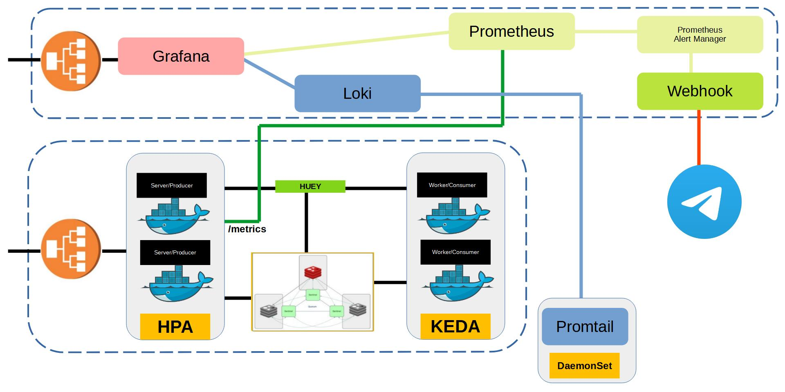

In this document, we discuss the system architecture, the high-level design decisions, as well as how the code is structured and how to test the system.

When deployed to a K8s Cluster, the system will look something like the following:


# High-Level Design
The system has 2 Main components:
1) Application (running in the `keda` namespace)
2) Monitoring (running in the `keda-monitoring namespace`)

## The Application
The application itself can be divided into 3 components:
1) The API Server
2) The Huey Worker
3) The Redis DB

### API Server
The API Server is the simplest of the three components: a Fast API Server that produces tasks, running in a Horizontal Pod AutoScaler.
The server has separate ports for handling the API endpoints (8000) and exposing its Prometheus metrics (9001).

### Huey Worker
The Huey Worker, or Consumer, is the application that consumes the tasks produced by the API Server. This application is scaled using `KEDA`, based on the number of tasks queued in `Redis`.

### Redis
Now, let's look at the more complicated part of the application: deploying Redis.
Redis is an in-memory DB, but we would like to persist data on the disk so we don't lose data when a Redis Pod is rescheduled.

For deploying Redis, I have used the Helm charts provided by Bitnami (`https://charts.bitnami.com/bitnami`) with some custom configuration.

#### High Availability vs Clustering
I have chosen to run Redis in the "High Availability" mode using Redis Sentinels.

Redis Clustering would involve storing keys on different Redis nodes by sharding. However, this comes with read/write limitations. 

#### Pod Anti-affinity
In a Cloud Deployment Environment, I would like to make sure that the Redis Sentinels don't run on the same node as the Redis Master they are tracking, as, in this case, the failure of that node will destroy the High Availability System.

We can customize our deployments to specify `podAntiAffinity` relative to other pods using labels.

But, since I am using Minikube, I only have one node to schedule all the pods on. :(

### External Traffic
The API Server is connected to a `LoadBalancer` service through which the APIs can be accessed from outside the Cluster. For the purpose of this demo, we will give this service an external IP using the `minikube tunnel` command. For deployment in the Cloud, I would proceed with K8s `Ingress`.

### Metrics Service
We do not want the Metrics of the API Server to be exposed outside the Cluster, since they are only to be picked up by `Prometheus`, which in our setup is running inside the Cluster. Therefore, we have another service, of the type `ClusterIP`, that targets the port 9001 on the API Server pod. The sole purpose of this service is to expose the server's metrics.

## The Monitoring Stack
The monitoring stack involves the following components:
1) Prometheus (with AlertManager)
2) Loki
3) Promtail
4) Grafana
5) Webhook
The first 4 components are part of the `loki-stack` Helm Chart.

## Loki Stack (Loki, Promtail, Prometheus, Grafana)
The values used while installing this Helm Chart are specified in the `kubernetes/monitoring-stack/monitoring-values.yaml` file.

`Loki` is a log aggregation system.
`Promtail` is an agent that is used to ship logs to `Loki`.
`Prometheus` scrapes metrics from all the pods in the Cluster and aggregates them.
`Grafana` is a web-based user interface that can be used to observe the Logs and Metrics.

### External Traffic
Only `Grafana` is to be accessed from outside the Cluster. Therefore, we have a LoadBalancer service connected to it. Once again, in the Cloud, an Ingress would be preferred here.

## Webhook
In order to send us messages on Telegram when certain alerts are fired in Prometheus, I have set up a simple webhook that can be called by the `Prometheus Alert Manager` when it receives an alert from `Prometheus`.

The Webhook is a simple `express` server that connects to `Telegram` using the `node-telegram-bot-api` package. See [DEPLOYMENT.md](./DEPLOYMENT.md) to know more about how to deploy it to send you messages on `Telegram`.

# Low-Level Design
The codebase is divided into 4 main folders:
1) kubernetes
2) server-and-worker
3) tests
4) webhooks

## kubernetes
This directory contains all the manifest files for the K8s resource we will create in our Cluster during deployment. It also contains values files used to customize the Helm Charts we install in our system.

## server-and-worker
The API Server and Huey Worker are built into two different Docker images. But, since both of the applications have multiple files in common, they are structured in the same folder.

##### Alternative approaches and trade-offs
1) An alternate approach would be to use three folders such as `server`, `worker`, and `common`, in which the first two contain the server and worker files and the last one contains the common files required by both. -- This approach has two problems:
a) It complicates the process of building Docker images.
b) Most IDEs will not provide IntelliSense on the files contained in the `common` folder when one is working in the other two folders.

2) Another alternative approach could be to duplicate the files from the `server` folder to `worker`. -- This approach also has some issues:
a) The files may be unsynchronized.
b) The codebase now contains redundant files.

Once the docker images have been built, both the server and the worker can be started by running:
```
docker compose up
```

The `src` folder contains the primary package code. Here's a quick overview of all the files in it:
1) `app.py`: the FAST API application.
2) `models.py`: Pydantic Models required for the FAST API application (Request Schemas).
3) `redis_client.py`: contains a Redis Client that connect to a Redis Server based on the configuration specified in environment variables.
4) `tasks.py`: contains the Huey instance and Huey tasks

### server
The server is built using Fast API and it exposes two routes - one to add a task and another to get the current progress of a task.

It also exposes Prometheus metrics in another HTTP server that runs on the port given by the environment variable `METRICS_PORT`.

#### Open API
If you have the API Server deployed or running in development, it is possible to access the Open API specification or the Swagger Page by visiting `{{serverUrl}}/openapi.json` or `{{serverUrl}}/docs` respectively.

### worker
The worker application is a Huey Worker that has one task defined in it called `long_task`. The task counts from 0 to 100 million and updates its progress in `Redis` after every one million.

For building the server or worker Docker images and deploying it, please refer to the [DOCKER_BUILD.md](./DOCKER_BUILD.md).

## tests
### api_tests.py
This files defines some simple logical tests for our API:
1) Adding a task
2) Polling a task's progress
3) Trying to poll the progress of a task that does not exist.

### load-tests
These are high-volume API tests that are executed using `K6`. More info on this in the `Testing` section at the end of this document.

## webhooks
### alerter-bot
This directory contains the source code for our express server that is linked to our Telegram bot. The server exposes a simple HTTP post endpoint that can be called by the Prometheus Alert Manager. On receiving a request at this endpoint, the server constructs a message and sends it to the configured Telegram user ID.

For building the webhook into a Docker image and deploying it, please refer to the [DOCKER_BUILD.md](./DOCKER_BUILD.md).

# Testing
For testing our system, we will be using `K6`, which is a load-testing tool. With `K6`, we can easily write tests that scale across multiple Virtual Users and Iterations.

We have defined some tests in the `kubernetes/tests/load-tests` folder.

The simplest test is the `test_vu-5_iter-10.js` file.
In order to run this test, execute:
```
k6 run kubernetes/tests/load-tests/test_vu-5_iter-10.js
```

This is a simple test that creates 5 virtual users and adds a total of 10 tasks to the system, and then queries the status of those tasks.

The `test_vu-20_iter-20.js` and `test_vu-20_iter-50.js` files do the same but on a larger scale.

The `test_ramp-vu-50_iter-100.js` test slowly ramps the number of Virtual Users up and then slowly reduces them.

The `common.js` file defines the common logic used in the test cases.
